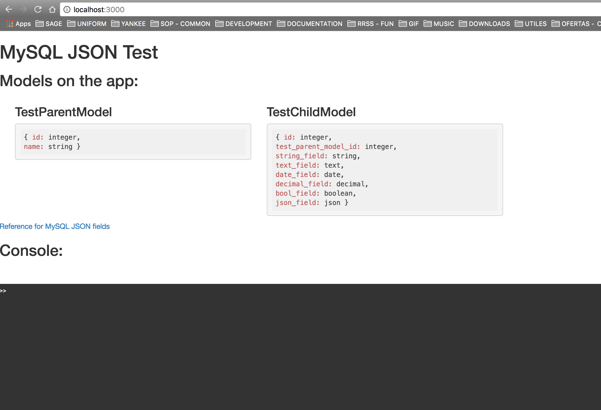

MySQL JSON Field Test
=====================

Playground to check how JSON fields work. It shows a console in the index view.



## Dependencies
- MySQL > 5.7.8 (JSON Fields needed)

## Setup
PLEASE NOTE that [seeds](./db/seeds.rb) for this project will load by default <b>100.000</b> records on the DB to test performance on it.
But don't worry. You can start running the app without waiting seeds to finish.

```
git clone git@github.com:stevebelicha/mysql-json-test.git
cd mysql-json-test
bundle install
bundle exec rake db:create db:seed
bundle exec rails s
```
